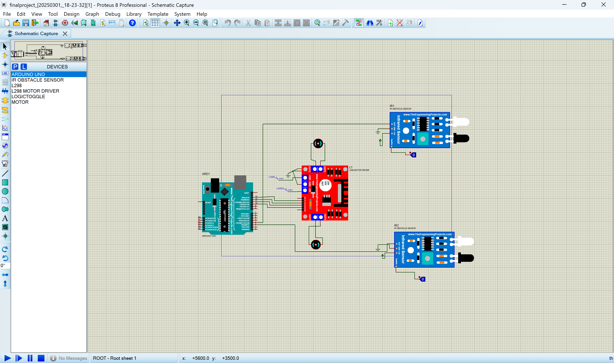

# 🤖 Line Following Robot – Arduino + Proteus Simulation

This project demonstrates the **simulation of a Line Following Robot** using **Arduino UNO** and **Proteus 8 Professional**. The robot uses **IR sensors** to detect a black line on a surface and adjusts its movement using a **motor driver module**.

The simulation is built entirely in Proteus, and the control logic is written in Arduino's C-based language. This project is useful for learning how real-world line-following robots function using sensor-based input and motor control.

---

## 🧠 Project Objective

To simulate an autonomous robot that follows a predefined black path using IR sensors and motor logic coded into an Arduino UNO microcontroller.

---

## 🛠️ Tools & Components Used

- **Software:**
  - [Proteus 8 Professional](https://www.labcenter.com/)
  - [Arduino IDE](https://www.arduino.cc/en/software)

- **Hardware Components (simulated):**
  - Arduino UNO
  - 2 × IR Sensors
  - L298N Motor Driver Module
  - DC Motors
  - Power Supply
  - Robot Chassis
  - Connecting Wires

---

## 📂 Files in this Repository

- `line_follower_code.ino`  
  → Arduino sketch with the code to control the robot behavior based on IR sensor input.

- `linefollowingsimulation.pdsprj`  
  → Main Proteus simulation project file. Open this in Proteus to view and run the circuit.

- `line_follower_robot.png`  
  → Screenshot of the circuit design as seen in Proteus.

---

## 🚀 How to Run This Project

### 1. Set up the Simulation in Proteus
- Open `linefollowingsimulation.pdsprj` in **Proteus 8 Professional**.
- The circuit should include an Arduino UNO, IR sensors, motor driver, and motors.
- Upload the `line_follower_code.ino` code into the Arduino in Proteus using the source file option.

### 2. Upload the Code
- You can upload the code using:
  - Proteus Virtual Terminal
  - Pre-compiling the code in Arduino IDE and linking the `.hex` file in Proteus

### 3. Run the Simulation
- Once everything is set up, **run the simulation**.
- The robot should follow the black line based on the logic implemented in the code.

---

## 🧾 Code Logic Overview

- The robot reads the values from two IR sensors (left and right).
- If the left sensor is on the line and the right is off, it turns left.
- If the right is on the line and the left is off, it turns right.
- If both sensors detect the line, it moves forward.
- If neither detects the line, it stops.

---

## 📸 Circuit Preview

---

## 📃 License

This project is licensed under the **MIT License**.  
Feel free to use, modify, and share with credit.

---

## 🙋‍♀️ Author

**Swaroopa**  
> If you have suggestions or feedback, feel free to [open an issue](https://github.com/your-username/line-following-robot/issues) or fork the repo and improve it!

---

